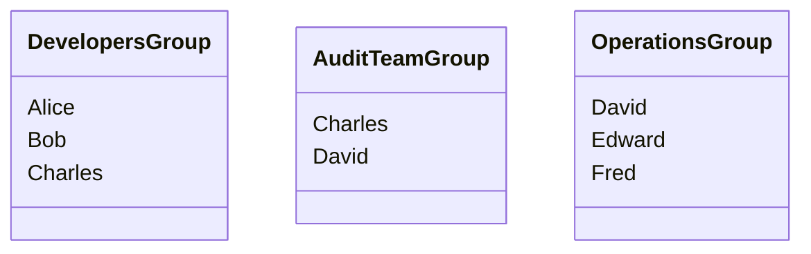

---
puppeteer:
  printBackground: true
export_on_save:
    puppeteer: true
---

# Users and Groups

## What is IAM?

AWS Identity and Access Management (IAM) is a web service that helps you securely control access to AWS resources. It enables you to manage users, groups, and permissions to allow or deny access to AWS resources.

## What is a user?

An IAM user is an entity that you create in AWS to represent the person or service that uses it to interact with AWS. A user in AWS consists of a name and credentials. The credentials are used to authenticate the user when interacting with AWS services and resources.

## What is a group?

An IAM group is a collection of IAM users. Groups let you specify permissions for multiple users, which can make it easier to manage the permissions for those users. For example, you could have a group called `Admins` and give that group the types of permissions that administrators typically need or a group called `Developers` and give that group the types of permissions that developers typically need.

- Groups only contain users, not other groups.
- users can belong to multiple groups or none at all.

## What is a policy?

A policy, in the context of cloud services like AWS, is a document that defines permissions and specifies what actions are allowed or denied for various resources. It is used to manage access to AWS resources and services securely. Policies are written in JSON (JavaScript Object Notation) and include elements such as the version, an identifier, a list of permissions (statements), and effect, action, resource, and condition keys that outline the specifics of the access permissions.

For example, an AWS Identity and Access Management (IAM) policy allows you to specify who (users, groups, roles) has permission to access which AWS resources and what they can do with those resources.

In AWS, you apply the principle of least privilege by granting only the permissions required to perform a task.

!!! note
    The **principle of least privilege** is a security concept that refers to giving a user account or process only those privileges which are essential to perform its intended function. In other words, a user or application should have the minimum levels of access—or permissions—needed to perform their tasks. This helps reduce the attack surface by limiting access rights for users, accounts, and computing processes to only those resources absolutely required to carry out legitimate activities. If a system is compromised, the principle of least privilege can help contain the potential damage by limiting the capabilities that an attacker would have at their disposal.
