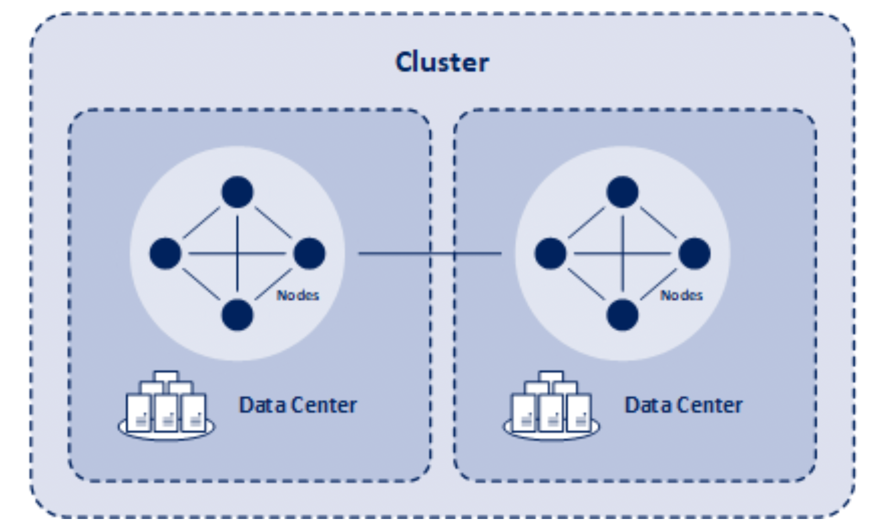

---
puppeteer:
  printBackground: true
export_on_save:
    puppeteer: true
---

# Introduction

Apache Cassandra is a highly scalable, high-performance distributed database designed to handle large amounts of data across many commodity servers, providing high availability with no single point of failure. It is a type of NoSQL database.

Cassandra provides a structured key-value store with eventual consistency. "Eventual consistency" means that updates to a database will propagate to all nodes in a cluster, eventually.

Cassandra's distribution design is based on Amazon's Dynamo and its data model on Google's Bigtable. Created at Facebook, it differs from relational database management systems in many fundamental ways.

Key features of Cassandra include:

- **Distributed**: Every node in the cluster has the same role. There is no single point of failure. Data is distributed across the cluster (but can be replicated based on the application needs).
- **Scalable**: New nodes can be added to a running cluster easily for increasing capacity.
- **Fault-tolerant**: Data is automatically replicated to multiple nodes for fault-tolerance. Replication across multiple data centers is supported.
- **Tunable consistency**: Cassandra provides tunable data consistency. For example, you can choose between reading outdated data and waiting.
- **MapReduce support**: Cassandra has Hadoop integration, with MapReduce support. There is support also for Apache Pig and Apache Hive.
- **Query language**: Cassandra introduced CQL (Cassandra Query Language), a SQL-like language, to interact with the database.
- **Flexible schema**: Cassandra allows you to evolve your schema as your application evolves.

Cassandra is used by a number of organizations including Apple, Facebook, Twitter, Cisco, Rackspace, ebay, Twitter, Netflix, and more.

{width=50%}
[Image Source](http://bi-insider.com/posts/apache-cassandra-nosql-database/)

## Cassandra Instance

An **instance** typically refers to a single deployment of Cassandra running on a node (server). Each node in a cluster runs an instance of Cassandra. This instance is responsible for managing a portion of the data in the cluster, participating in the cluster's operations, handling client requests, and interacting with other instances (nodes) within the cluster to ensure data consistency, availability, and partition tolerance.

## Cluster or ring

A **cluster** in Cassandra is the entire network of nodes (servers) that participate in a Cassandra instance. It's the highest-level container in the architecture of Cassandra that represents the whole database system. A cluster consists of one or more data centers, which can be physical or virtualized, and are typically structured to support replication and redundancy for fault tolerance, performance, and scalability.

Clusters manage the distribution of data across nodes through the use of a partitioning strategy, where data is partitioned and replicated across multiple nodes to ensure durability and high availability. Cassandra uses a peer-to-peer distributed system design, where each node in the cluster can serve read and write requests without the need for a master node, enabling linear scalability and robustness.

Cassandra clusters have several key features:

- **Distributed Architecture**: Data is distributed across all nodes in the cluster, with support for replicating data across multiple nodes for fault tolerance.
- **Decentralized**: Every node in a Cassandra cluster can serve read and write requests, without a master-slave hierarchy, which eliminates bottlenecks and single points of failure.
- **Scalability**: Cassandra clusters can scale horizontally, meaning you can increase capacity by adding more nodes to the cluster without downtime.
- **Replication**: Cassandra provides flexible options to configure how data is replicated among nodes in the cluster to ensure data availability and durability.

## Nodes

A **node** is a single machine (server) in a Cassandra cluster or in another word, a node represents a single instance of Apache Cassandra. Each node stores a portion of the cluster's data and participates in the cluster's operations. Nodes are where the data is actually stored, and they work together to provide the functionality of the database. The key characteristics of a node in Cassandra include:

- **Data Storage**: Each node contains a subset of the cluster's data, determined by the cluster's partitioning scheme. Cassandra uses a consistent hashing mechanism to distribute data across nodes.
- **Peer-to-Peer Architecture**: Nodes communicate with each other as peers, without any hierarchical master-slave relationships, making the system highly resilient and ensuring no single point of failure. Nodes communicate with one another through a protocol called **gossip**, which is a process of computer peer-to-peer communication.
- **Replication**: Nodes participate in data replication according to the defined replication strategy, which specifies how many copies of data should exist and how they are distributed across the cluster. This is critical for fault tolerance and data availability.
- **Request Handling**: Nodes can handle client requests for both reads and writes. In the event of a node failure, other nodes can take over its responsibilities, ensuring continuous availability of the service.

In summary, a cluster is the whole Cassandra database system, while nodes are the individual servers that store data and participate in the cluster's distributed operations. Together, they form the basis of Cassandra's architecture, enabling it to provide a highly available, scalable, and fault-tolerant data storage solution.

## Explanation through an example

Let's use an example of a Cassandra deployment across multiple data centers in Europe, Asia, and North America to explain the concepts of data centers, clusters, nodes, and instances in Apache Cassandra's architecture.

### Data Center

A data center in Cassandra is a logical grouping of nodes, typically defined by geographical location or use case (such as separating operational data from analytical data). For example, there would be at least three data centers: one each in Europe, Asia, and North America.

### Cluster

A cluster is a collection of one or more data centers. It represents the entire Cassandra database system spanning all geographical locations in the scenario. All the data centers in Europe, Asia, and North America together form a single Cassandra cluster.

### Node

A node is a single instance of Cassandra running on a server or a virtual machine. Each data center comprises multiple nodes. These nodes are where the data is physically stored and managed.

### How they are connected

**Across Data Centers:** In the global deployment example, each data center (Europe, Asia, North America) contains multiple nodes (servers) running Cassandra. These data centers can be configured to serve different purposes (e.g., one for transactional data and another for analytics) or to simply replicate data across regions for disaster recovery and local read/write access to reduce latency.

**Cluster Coordination:** Despite the physical separation, all nodes across all data centers are part of a single Cassandra cluster. They are connected and communicate with each other using the gossip protocol, a peer-to-peer communication mechanism that keeps the topology of the cluster (which nodes are in which data centers, which nodes are up or down, etc.) updated across all nodes.

**Data Replication and Consistency:** Cassandra allows you to configure replication strategies at the data center level. This means you can specify how many copies of your data you want in each geographical location. For example, you might want three copies of your data in Europe and Asia but only two copies in North America. When a write or update occurs, Cassandra ensures that the data is replicated across the specified number of nodes in the specified data centers, according to the chosen consistency level. This ensures data availability and durability.

**Masterless Architecture:** Every node in the cluster can handle read and write requests, regardless of which data center it's in. There is no master node; all nodes are equal, contributing to Cassandra's high availability and fault tolerance. If a node or even an entire data center goes down, the cluster can continue to function, serving requests from nodes in the remaining data centers.

**Logical "Ring":** The cluster's nodes are organized in a logical ring structure, which determines how data is partitioned and distributed across the nodes. Each node is responsible for a range of data determined by partition keys, and the ring structure helps in locating the nodes responsible for a particular piece of data efficiently.

## Wide Column Store

The term **wide column store** refers to a type of database architecture and is a category of NoSQL databases. Apache Cassandra is an example of a wide column store. In a wide column store, data is stored in **tables** (sometimes called **column families**), which contain rows and columns. However, the way data is structured and managed in wide column stores is significantly different from traditional relational databases. Here are the key characteristics and concepts related to wide column stores:

### Key Concepts

- **Dynamic Column Creation**: Unlike traditional relational databases, wide column stores allow for the dynamic addition of columns in a row. This means that each row does not need to have the same set of columns, and columns can be added to individual rows on the fly. This flexibility allows for a schema-less or schema-flexible approach to data storage.

- **Columns and Column Families**: In wide column stores, data is organized into **column families** (comparable to tables in relational databases). A column family contains rows with a unique key, and each row can have any number of columns. Columns are grouped together within a row, and this grouping can be very wide, potentially containing millions of columns.
Consider this example that a column family named `UserProfile` where each row represents a user. The row key might be the user `ID`, and the columns in each row could include user attributes like `name`, `email`, and a dynamically added set of columns for user preferences. Each user's row could have a different set of preference columns, reflecting the varied interests of each user. Here, "columns are grouped together" within each row means that all data related to a user (the row key) is stored and accessed together, enabling efficient data operations per user.

- **Sparse Data Optimization**: Wide column stores are optimized for handling sparse data, where many columns might have null or empty values. This is because columns are created dynamically, and only non-empty columns are stored. This leads to efficient storage utilization.

- **Composite Keys**: Wide column stores often support composite keys, which are made up of a **partition key** and a **clustering key**. The partition key determines the distribution of data across the cluster, while the clustering key determines the order of data within the partition.

### Data Model Characteristics

- **Row-Oriented Storage**: Despite being called "wide column stores," they are technically row-oriented. Data is stored in rows, and each row is identified by a unique key. However, the emphasis on columns comes from the flexibility and the dynamic nature of how columns can be used within those rows.

- **Highly Scalable**: Wide column stores are designed for scalability, allowing for the distribution of data across many nodes in a cluster. This makes them suitable for applications that require high performance and availability.

- **Use Cases**: They are well-suited for handling large volumes of data, time-series data, and data that doesn't fit neatly into a traditional relational model. This includes applications like real-time analytics, sensor data management, and any scenario where data access patterns are well-defined and read/write performance is critical.

## CQL (Cassandra Query Language)

CQL is a query language for the Apache Cassandra database that mimics SQL (Structured Query Language) in syntax. CQL provides an intuitive way to interact with Cassandra by using statements to perform database operations such as creating keyspaces, defining tables, inserting data, querying data, and modifying data. Despite its SQL-like syntax, it's important to remember that Cassandra's architecture and data model are fundamentally different from traditional relational databases.

## Replicas and Replication in Cassandra

In the context of Apache Cassandra and other distributed databases, replicas refer to copies of data stored on different nodes within the cluster to ensure high availability, fault tolerance, and data durability. Replication is a fundamental aspect of distributed databases, enabling them to provide continuous access to data even in the event of node failures or network partitions. Here's a detailed look at how replicas work in Cassandra:
