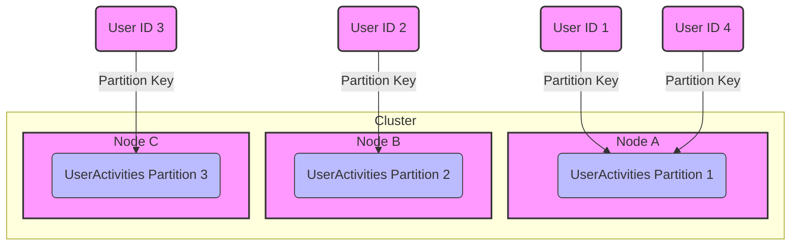

# Keys

In Apache Cassandra and similar wide column stores, keys play a crucial role in data modeling, data distribution, and access patterns. Understanding the different types of keys is essential for designing efficient and scalable Cassandra schemas. Here's an overview of the key types.

## Primary Key

The primary key is fundamental in Cassandra's data model, uniquely identifying each row in a table. It determines how data is stored and retrieved. The primary key consists of two parts:

1. partition key
2. clustering columns (optional)

**Syntax**
In a table definition, the primary key is defined within parentheses following the `PRIMARY KEY` keyword. For example:

```sql
PRIMARY KEY (partition_key, clustering_column_1, clustering_column_2)
```

## Partition Key

The partition key is the first part of the primary key and is crucial for data distribution across the cluster. It determines which node stores a particular row of data.

- **Data Distribution**: Cassandra uses the partition key to hash and distribute rows across nodes in the cluster, ensuring data is spread evenly.
- **Access Pattern**: Queries that specify the partition key can retrieve data efficiently because Cassandra knows exactly which node(s) to query.

## Clustering Columns

Clustering columns are the optional part of the primary key that follow the partition key. They define the order in which rows are sorted within a partition.

- **Sorting**: Data within a partition is sorted based on clustering columns. This is important for queries that need to retrieve data in a specific order without requiring additional sorting.
- **Uniqueness**: Adding clustering columns to a primary key can ensure row uniqueness beyond the partition key.

### Example Scenario

Let's illustrate the concepts of nodes, clusters, partition keys, and how they interact in Apache Cassandra. For this example, consider a simplified Cassandra setup with a cluster consisting of three nodes and a table designed to store user activity data.

- **Table**: `UserActivities` with a primary key composed of a partition key (`user_id`) and a clustering column (`activity_timestamp`).

The partition key (`user_id`) determines how data is distributed across the cluster, and the clustering column (`activity_timestamp`) determines the order of the data within the partition.

- **Cluster**: A collection of three nodes (Node A, Node B, Node C) that work together to store and manage data.
- **Node A, Node B, Node C**: Individual servers that hold partitions of the data.
- **Partition Key (`user_id`)**: Determines the distribution of data across nodes.
- **Clustering Column (`activity_timestamp`)**: Sorts data within a partition.

Let's use a simple diagram to visualize how a partition key (`user_id`) distributes data across a cluster:



**Explanation**
Each user (`User ID 1`, `User ID 2`, etc.) is assigned to a node based on the hash of their `user_id` (the partition key). This ensures data is evenly distributed across the cluster. For example, `User ID 1` and `User ID 4` hash to partitions that reside on `Node A`, while `User ID 2` and `User ID 3` hash to partitions on `Node B` and `Node C`, respectively. This setup demonstrates how Cassandra utilizes the partition key to distribute data across a cluster, ensuring scalability and fault tolerance.

## Composite Partition Key

When a primary key consists of more than one column as the partition key, it's called a composite partition key. This approach is used to distribute data more granularly across the cluster.

- **Syntax**: Composite partition keys are defined by grouping columns within parentheses. For example: `PRIMARY KEY ((partition_column_1, partition_column_2), clustering_column_1)`.

## Secondary Index

A secondary index allows querying data on non-primary key columns. It provides a way to access data without knowing the partition key.

- **Usage**: Useful for querying based on columns that are not part of the primary key. However, secondary indexes can have performance implications and should be used judiciously.

## Materialized Views

Materialized views are not keys but are related to how data can be accessed. They automatically maintain a data view based on a primary key different from the base table, offering an alternative access path to the data.

- **Automatic Update**: Materialized views stay in sync with the base table, updating as data changes.
- **Use Case**: Ideal for scenarios where you need to query the same data in different ways, based on different keys.

## Conclusion

The design of keys in Cassandra is a critical aspect of schema design, influencing both the database's performance and how data can be accessed. A well-thought-out key strategy can lead to efficient data distribution, fast queries, and overall high performance of the Cassandra cluster. Understanding the nuances of each type of key helps in optimizing data models for specific application needs and access patterns.