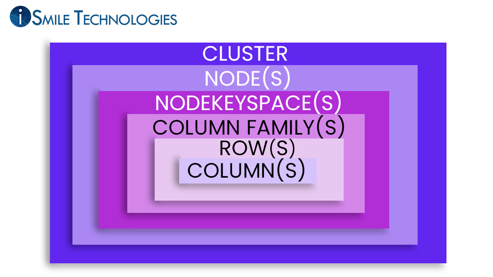

---
puppeteer:
  printBackground: true
export_on_save:
    puppeteer: true
---

# Terminology

- Eventual consistency
    Means that updates to a database will propagate to all nodes in a cluster, eventually.

- cluster
    In the context of computing, a "cluster" refers to a group of servers or computers that work together to perform tasks more efficiently, provide higher availability, or offer increased computing power compared to a single device.
    A cluster refers to a group of nodes (servers) that store data.

    
    [Image Source](https://www.ismiletechnologies.com/technology/an-overview-of-cassandra-architecture/)

- Gossip
  Nodes communicate with one another through a protocol called **gossip**, which is a process of computer peer-to-peer communication.

- Distributed Architecture
    A distributed architecture means that Apache Cassandra can and does typically run on multiple servers while appearing to users as a unified whole. This is in contrast to a centralized architecture, where all the components of a system are located on a single server, for example, a single database server.
