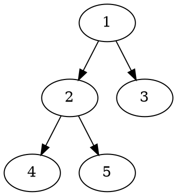

# Pre-Order Traversal

## Implementation

Pre-order traversal is to visit the root first. Then traverse the left subtree. Finally, traverse the right subtree. Here is an example:


In the above example, the pre-order traversal is `1 2 4 5 3`.



```js
class Node {
    constructor(value){
        this.value = value;
        this.left = null;
        this.right = null;
    }
}

function preOrderRecursive(node) {
    if (node != null) {
        console.log(node.value);
        preOrderRecursive(node.left);
        preOrderRecursive(node.right);
    }
}

// Let's create a binary tree and traverse it
let root = new Node(1);
root.left = new Node(2);
root.right = new Node(3);
root.left.left = new Node(4);
root.left.right = new Node(5);

preOrderRecursive(root);  // Output: 1 2 4 5 3
```

Here is the code for pre-order traversal using a stack:

```js
class Node {
    constructor(value){
        this.value = value;
        this.left = null;
        this.right = null;
    }
}

function preOrderWithoutRecursion(root) {
    let stack = [];
    stack.push(root);

    while(stack.length > 0) {
        let node = stack.pop();
        console.log(node.value);

        // right child is pushed first so that left is processed first
        if(node.right) {
            stack.push(node.right);
        }
        if(node.left) {
            stack.push(node.left);
        }
    }
}

// Let's create a binary tree and traverse it
let root = new Node(1);
root.left = new Node(2);
root.right = new Node(3);
root.left.left = new Node(4);
root.left.right = new Node(5);

preOrderWithoutRecursion(root);  // Output: 1 2 4 5 3

```

## Time and Space Complexity

The time complexity for both recursive and iterative (using a stack) pre-order tree traversal is O(n), where n is the number of nodes in the tree. This is because each node in the tree is visited exactly once, regardless of the method used.

Here's a breakdown:

1. **Recursive Pre-Order Traversal**: In the recursive approach, each node is visited once and a function call is made. This results in a time complexity of O(n).

2. **Iterative Pre-Order Traversal (using a stack)**: In the iterative approach, each node is also visited once. We push each node onto the stack and then pop it off. These operations take constant time, so the overall time complexity is O(n).

In terms of space complexity, the recursive approach has a space complexity of O(h), where h is the height of the tree. This is because of the extra space required for the call stack. The iterative approach also has a space complexity of O(h) because it requires a stack, and in the worst case, if the tree is skewed, we might end up pushing all nodes to the stack.

So, in terms of time complexity, both approaches are equivalent. The choice between them usually depends on other factors, such as the size of the call stack (which can cause a stack overflow in the recursive approach for very large trees), and the clarity and readability of the code.
