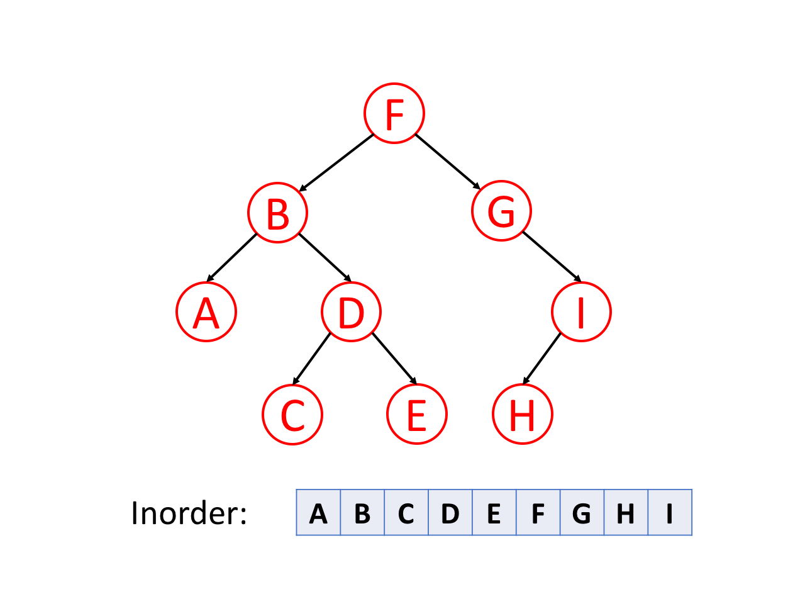
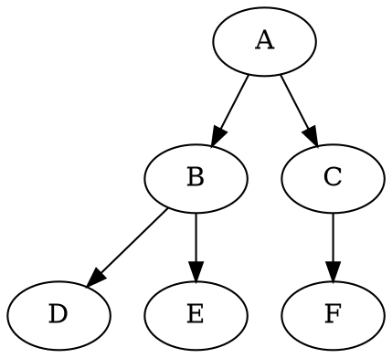

# In-order Traversal

In-order traversal is a strategy used for tree traversal where the traversal order is left subtree -> root node -> right subtree. This strategy is applied recursively to all subtrees starting from the root of the tree.



Typically, for Binary Search Tree (BST), we can retrieve all the data in sorted order using `in-order traversal`.

Here is a simple representation of a binary tree:

```plaintext
    A
   / \
  B   C
 / \   \
D   E   F
```

In the context of this tree, an in-order traversal would visit the nodes in the following order: D, B, E, A, C, F.

This is because for each subtree:

1. It first visits all nodes in the left subtree. For the root node A, this means it first visits the subtree rooted at B.
2. It then visits the root node of the subtree. After visiting all nodes in the subtree rooted at B, it visits A.
3. Finally, it visits all nodes in the right subtree. For the root node A, this means it visits the subtree rooted at C.

This process is applied recursively to each subtree. For example, for the subtree rooted at B, it first visits D (the left subtree), then B itself, and finally E (the right subtree).



In-order traversal is particularly useful when dealing with binary search trees (BSTs), as it allows the nodes to be visited in ascending order. This is because for any node in a BST, all nodes in its left subtree have values less than the node, and all nodes in its right subtree have values greater than the node. Therefore, visiting the left subtree first, then the root node, and finally the right subtree results in visiting the nodes in ascending order of their values.

## Implementation

Let's define the binary tree, implement the in-order traversal function, and test the function:
Here is the binary tree we will be using for this example:

```markdown
    A
   / \
  B   C
 / \   \
D   E   F
```

In this implementation we use iteration and stack.

```js
// Define a class for the nodes of the binary tree
class Node {
  constructor(value) {
    this.value = value;  // The value stored in the node
    this.left = null;    // The left child of the node
    this.right = null;   // The right child of the node
  }
}

// Define the in-order traversal function
function inOrder(root) {
    var stack = [];  // Stack to keep track of nodes to be visited
    var result = [];  // Array to store the values of visited nodes
    var current = root;  // Start with the root node

    // Continue as long as there are unvisited nodes
    while (current !== null || stack.length > 0) {
        // Go as far left as possible
        while (current !== null) {
            stack.push(current);  // Push the current node onto the stack
            current = current.left;  // Move to the left child
        }
        // When we can't go left anymore, visit the node at the top of the stack
        current = stack.pop();  // Remove the node from the stack
        result.push(current.value);  // Add the node's value to the result array
        current = current.right;  // Move to the right child
    }
    return result;  // Return the result array
}

// Create a binary tree
let root = new Node('A');
root.left = new Node('B');
root.right = new Node('C');
root.left.left = new Node('D');
root.left.right = new Node('E');
root.right.right = new Node('F');

// Perform an in-order traversal of the tree and log the output
console.log(inOrder(root));  // Output: ['D', 'B', 'E', 'A', 'C', 'F']
```

Here's how you can implement in-order traversal in JavaScript using recursion:

```js
class Node {
  constructor(value) {
    this.value = value;
    this.left = null;
    this.right = null;
  }
}

function inOrder(node) {
  if (node !== null) {
    inOrder(node.left);  // Recursively visit the left subtree
    console.log(node.value);  // Process the current node
    inOrder(node.right);  // Recursively visit the right subtree
  }
}

let root = new Node('A');
root.left = new Node('B');
root.right = new Node('C');
root.left.left = new Node('D');
root.left.right = new Node('E');
root.right.right = new Node('F');

inOrder(root);  // Output: 'D', 'B', 'E', 'A', 'C', 'F'
```

## Time Complexity

The time complexity of both the recursive and iterative in-order traversal algorithms for a binary tree is O(n), where n is the number of nodes in the tree.

In both the recursive and iterative versions of the in-order traversal algorithm, each node in the binary tree is visited exactly once. When a node is visited, a constant amount of work is done, such as processing the node's value and moving to the next node. Because this work does not depend on the size of the tree, we say it takes constant time, or O(1).

Since each node is visited once and O(1) work is done for each node, the total amount of work done is proportional to the number of nodes in the tree. Therefore, the time complexity of the in-order traversal algorithm is O(n).

This time complexity is the same for all binary tree traversal algorithms, including pre-order and post-order traversal, because they all visit each node in the tree exactly once.
