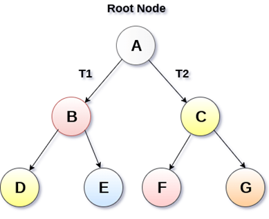

# Binary Trees

A binary tree is a tree data structure in which each parent node can have at most two children. Each node of a binary tree consists of a data element and references to its left and right child nodes.

<figure class='image'>

  
  <figcaption class='caption'>Binary Tree</figcaption>
</figure>

There are several types of binary trees, each with unique characteristics:

1. **Full Binary Tree**: This is a special kind of binary tree where each node has either zero children or two children. In other words, all the nodes in that binary tree should either have two child nodes of its parent node or the parent node is itself the leaf node or the external node.

2. **Complete Binary Tree**: This is a type of binary tree where all the tree levels are filled entirely with nodes, except the lowest level of the tree. Also, in the last or the lowest level of this binary tree, every node should possibly reside on the left side.

3. **Perfect Binary Tree**: A binary tree is said to be 'perfect' if all the internal nodes have strictly two children, and every external or leaf node is at the same level or same depth within a tree. A perfect binary tree having height ‘h’ has 2^h – 1 node.

4. **Balanced Binary Tree**: A binary tree is said to be 'balanced' if the tree height is O(logN), where ‘N’ is the number of nodes. In a balanced binary tree, the height of the left and the right subtrees of each node should vary by at most one. An AVL Tree and a Red-Black Tree are some common examples of data structure that can generate a balanced binary search tree.

5. **Degenerate Binary Tree**: A binary tree is said to be a degenerate binary tree or pathological binary tree if every internal node has only a single child. Such trees are similar to a linked list performance-wise.

6. **Skewed Binary Tree**: A binary tree where all nodes are either left children or right children. There are two types: left-skewed (all nodes are left children) and right-skewed (all nodes are right children).

Special types of binary trees used for specific purposes include:

- **Binary Search Trees (BST)**: A binary tree where all nodes to the left of a node have values less than the node's value, and all nodes to the right have values greater than the node's value.

- **AVL Trees**: A self-balancing binary search tree where the heights of the two child subtrees of any node differ by at most one.

- **Red-Black Trees**: A self-balancing binary search tree where each node has an extra bit for denoting the color of the node, either red or black.

- **Heap**: A special tree-based data structure where the tree is a complete binary tree. There are two types: Max-Heap (parent nodes have a greater value than or equal to their children) and Min-Heap (parent nodes have a lesser value than or equal to their children).

Each of these binary tree types has its unique features and specific applications in computer science.
