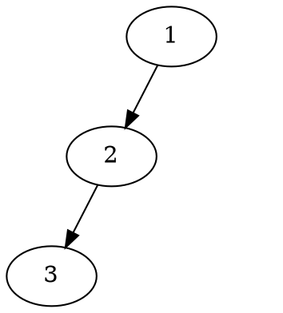
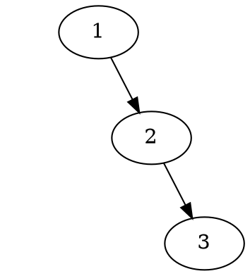

# Skewed Trees

In the context of binary trees, a "skewed" tree is one that is unbalanced to one side. There are two types of skewed binary trees:

1. **Left-Skewed Binary Tree**: A binary tree is said to be left-skewed if all of its nodes have only left children. In other words, no node in the tree has a right child. This kind of tree resembles a linked list moving in the left direction.

2. **Right-Skewed Binary Tree**: Similarly, a binary tree is said to be right-skewed if all of its nodes have only right children. No node in the tree has a left child. This kind of tree resembles a linked list moving in the right direction.

Here's a simple visual representation of what skewed binary trees look like:

Left-Skewed:

Right-Skewed:

Skewed trees are not efficient for operations like search, insert, delete, etc., because they essentially behave like a linked list, leading to linear time complexity O(n) for these operations. This is why self-balancing binary search trees like AVL trees or Red-Black trees are often used, as they ensure the height of the tree remains logarithmic, leading to faster O(log n) time complexity for these operations.
