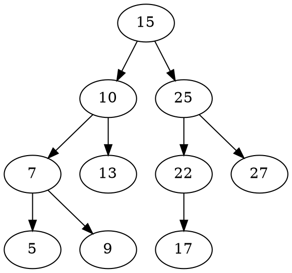

# Binary Search Tree (BST)


Binary Search Tree (BST) is an extension of Binary tree with some added constraints. In BST, the value of the left child of a node must be smaller than or equal to the value of its parent and the value of the right child is always larger than or equal to the value of its parent. This property of Binary Search Tree makes it suitable for searching operations as at each node we can decide accurately whether the value will be in left subtree or right subtree. Therefore, it is called a Search Tree.

<figure class='image'>

  
  <figcaption class='caption'>Binary Search Tree</figcaption>
</figure>

## Implementation

Here's a simple implementation of a Binary Search Tree (BST) in JavaScript using ES6 classes that creates below tree:



```js
class Node {
  constructor(data) {
    this.data = data;
    this.left = null;
    this.right = null;
  }
}

class BinarySearchTree {
  constructor() {
    this.root = null;
  }

  insert(data) {
    let newNode = new Node(data);

    if (this.root === null) {
      this.root = newNode;
    } else {
      this.insertNode(this.root, newNode);
    }
  }

  insertNode(node, newNode) {
    if (newNode.data < node.data) {
      if (node.left === null) {
        node.left = newNode;
      } else {
        this.insertNode(node.left, newNode);
      }
    } else {
      if (node.right === null) {
        node.right = newNode;
      } else {
        this.insertNode(node.right, newNode);
      }
    }
  }

  // other methods like search, remove, etc. can be added here
}

// Usage:
let BST = new BinarySearchTree();
BST.insert(15);
BST.insert(25);
BST.insert(10);
BST.insert(7);
BST.insert(22);
BST.insert(17);
BST.insert(13);
BST.insert(5);
BST.insert(9);
BST.insert(27);
```

Here is another implementation of BST in JavaScript using prototypal inheritance:

```js
function TreeNode(value) {
  this.value = value;
  this.leftChild = null;
  this.rightChild = null;
}

function BinarySearchTree() {
  this.root = null;
}

BinarySearchTree.prototype.insert = function (value) {
  const newNode = new TreeNode(value);
  if (!this.root) {
    this.root = newNode;
    return;
  }

  this.insertNode(this.root, newNode);
};

BinarySearchTree.prototype.insertNode = function (node, newNode) {
  if (newNode.value > node.value) {
    if (!node.rightChild) {
      node.rightChild = newNode;
    } else {
      this.insertNode(node.rightChild, newNode);
    }
  } else {
    if (!node.leftChild) {
      node.leftChild = newNode;
    } else {
      this.insertNode(node.leftChild, newNode);
    }
  }
};
```

## Time Complexity

First, let's break it down and analyze the time complexity of the best case scenario, which is when the tree is perfectly balanced.

In a perfectly balanced binary tree:

- At level 0 (the root), there's 1 node: $2^0 = 1$.
- At level 1, there can be up to 2 nodes: $2^1 = 2$.
- At level 2, there can be up to 4 nodes: $2^2 = 4$.
- At level 3, there can be up to 8 nodes: $2^3 = 8$.
- And so on...

In general, at level $h$, there can be up to $2^h$ nodes.

Now, if we consider a perfectly balanced binary tree with $h$ levels, the total number of nodes $n$ in the tree is the sum of the nodes at each level. This is a geometric series, and the sum can be calculated as:

$$n = 2^0 + 2^1 + 2^2 + ... + 2^h = 2^{h+1} - 1$$

The right-hand side of the equation $2^{h+1} - 1$ is the formula for the sum of a geometric series with a common ratio of 2 and $h+1$ terms. This formula gives the same result as adding up all the terms individually.

If we ignore the -1 (since it becomes negligible for large $n$), we can say:

$$n \approx 2^{h+1}$$

If we take the logarithm base 2 of both sides of this equation, we get:

$$\log_2(n) \approx h+1$$

Subtracting 1 from both sides gives:

$$h \approx \log_2(n) - 1$$

Again, if we ignore the -1 (since it becomes negligible for large $n$), we can say:

$$h \approx \log_2(n)$$

So, the height $h$ of a perfectly balanced binary tree is approximately $\log_2(n)$, where $n$ is the number of nodes. This is why we say that the height of a balanced binary tree is $O(\log n)$.

And since the time complexity of search, insert, and delete operations in a binary search tree is proportional to the height of the tree, we can say that the time complexity of these operations is $O(log\ n)$ in a balanced binary tree.

Now, let's analyze the time complexity of the worst case scenario, which is when the tree is a skewed tree.

Consider a scenario where you are inserting elements into a Binary Search Tree (BST) in a sorted order, like 1, 2, 3, 4, 5, etc. In this case, each inserted element is greater than the previous one, so each new node becomes the right child of the previous node. The BST that results from this is a skewed tree, specifically a right-skewed tree, which looks like this:

```markdown
1
 \
  2
   \
    3
     \
      4
       \
        5
```

In this tree, each parent node has only one child node, so the tree essentially behaves like a linked list. The height of the tree (the number of levels) is equal to the number of nodes `n` in the tree.

Now, let's say you want to insert a new node into this tree. You start at the root and move down the tree, comparing the new value with each node's value until you find the correct location for the new node. In the worst case (if the new value is greater than all existing values), you have to compare the new value with every node in the tree. This means you have to make `n` comparisons, where `n` is the number of nodes.

So, in the worst-case scenario where the BST is a skewed tree, the time complexity of the insert operation is O(n).

Therefore, the time complexity of the insert operation in a BST can range from O(log n) to O(n), depending on whether the tree is balanced or skewed.
