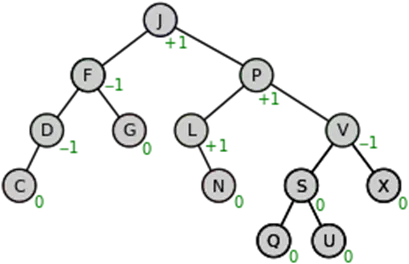

# AVL Tree

AVL tree is a **self-balancing binary search tree**. The name AVL is given on the name of its inventors Adelson-Velshi and Landis. This was the first dynamically balancing tree. In AVL tree, each node is assigned a balancing factor based on which it is calculated whether the tree is balanced or not. In AVL tree, the heights of children of a node differ by at most 1. The valid balancing factor in AVL tree are 1, 0 and -1.  When a new node is added to the AVL tree and tree becomes unbalanced then rotation is done to make sure that the tree remains balanced. The common operations like lookup, insertion and deletion takes O(log n) time in AVL tree. It is widely used for **Lookup operations**.

<figure class='image'>

  
  <figcaption class='caption'>Figure 4: AVL Tree</figcaption>
</figure>