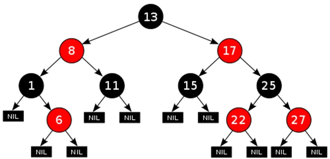

# Red-Black Tree

Red-Black is another type of **self-balancing** tree. The name Red-Black is given to it because each node in a Red-Black tree is either painted Red or Black according to the properties of the Red- Black Tree. This make sure that the tree remains balanced. Although the Red-Black tree is not a perfectly balanced tree but its properties ensure that the searching operation takes only O(log n) time. Whenever a new node is added to the Red-Black Tree, the nodes are rotated and painted again if needed to maintain the properties of the Red-Black Tree .

<figure class='image'>

  
  <figcaption class='caption'>Figure 5: Red-Black Tree</figcaption>
</figure>