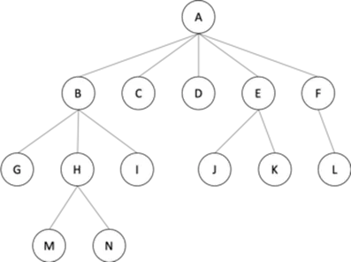

# N-ary Tree

In an N-ary tree, the maximum number of children that a node can have is limited to N. A binary tree is 2-ary tree as each node in binary tree has at most 2 children. Trie data structure is one of the most commonly used implementation of N-ary tree. A full N-ary tree is a tree in which children of a node is either 0 or N. A complete N-ary tree is the tree in which all the leaf nodes are at the same level.

<figure class='image'>

  
  <figcaption class='caption'>Figure 6: N-ary  Tree</figcaption>
</figure>