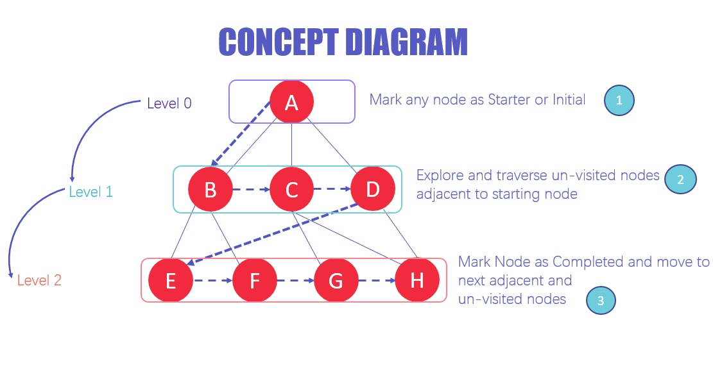

# Breadth-First Search (BFS)

Breadth-First Search (BFS) is an algorithm for traversing or searching tree or graph data structures. It starts at the tree root (or some arbitrary node of a graph, sometimes referred to as a 'source node'), and explores all of the neighbor nodes at the present depth prior to moving on to nodes at the next depth level.

BFS algorithm traverses the tree level by level and depth by depth.



Here's a step-by-step description of how BFS works:

1. **Start at the root**: BFS begins at the root node of the tree (or an arbitrary node for a graph) and explores all the neighbors of this node at the current depth level before moving on to nodes at the next depth level.

2. **Explore neighboring nodes**: BFS explores nodes in a breadth ward motion and uses a queue data structure to remember to get the next vertex(node) to start a search when a dead end occurs in any iteration.

3. **Mark nodes as visited**: As BFS traverses the tree, it marks each node as visited so that it doesn't revisit the same node.

4. **Move to the next depth level**: After BFS has explored all the neighboring nodes at the current depth level, it moves to the next depth level.

5. **Repeat until all nodes are visited**: The process continues in the same way until all the nodes in the tree or graph have been visited and explored.

BFS is used in a lot of different algorithms. For example, it's used in unweighted graph algorithms to find the shortest path between two nodes, in web crawlers to visit web pages, in network broadcasting systems, and in many more applications.

## Implementation

This function is implementing a Breadth-First Search (BFS) traversal on a binary tree. It starts from the root of the tree, then visits all the nodes level by level from left to right.

It finally test the function by creating below binary tree and calling the function on it.

```markdown
    10
   /  \
  6   15
 / \    \
3   8   20
```

```js
// Node class for creating nodes of the tree
class Node {
  constructor(value) {
    this.value = value;  // Value of the node
    this.left = null;  // Left child
    this.right = null;  // Right child
  }
}

// Binary Search Tree class
class BinarySearchTree {
  constructor() {
    this.root = null;  // Root of the tree
  }

  // Method to insert a new node into the BST
  insert(value) {
    const newNode = new Node(value);  // Create a new node
    if (!this.root) {
      // If the tree is empty, set the new node as the root
      this.root = newNode;
    } else {
      let current = this.root;
      while (true) {
        if (value < current.value) {
          // If the value is less than the current node's value, go left
          if (!current.left) {
            // If there's no left child, insert here
            current.left = newNode;
            return this;
          }
          current = current.left;  // Move to the left child
        } else {
          // If the value is greater than or equal to the current node's value, go right
          if (!current.right) {
            // If there's no right child, insert here
            current.right = newNode;
            return this;
          }
          current = current.right;  // Move to the right child
        }
      }
    }
  }

  // Method to perform a breadth-first search on the BST
  breadthFirstSearch() {
    const queue = new Map();  // Initialize a queue using a Map
    let current = this.root;  // Start at the root of the tree
    let index = 0;  // Index for the queue
    const visited = [];  // Array to store the visited nodes

    queue.set(index, current);  // Add the root to the queue

    // While there are nodes in the queue
    while (queue.size) {
      // Add the current node's value to the visited array
      visited.push(current?.value);

      // If there's a left child, add it to the queue
      if (current?.left) {
        index++;
        queue.set(index, current.left);
      }

      // If there's a right child, add it to the queue
      if (current?.right) {
        index++;
        queue.set(index, current.right);
      }

      let counter = 0;
      // Iterate over the queue
      for (const [key, node] of queue) {
        if (counter === 0) {
          // Remove the first node from the queue
          queue.delete(key);
          counter++;
          continue;
        }
        // Move to the next node in the queue
        current = node;
        break;
      }
    }
    // Return the array of visited nodes
    return visited;
  }
}

// Create a BST for testing
const bst = new BinarySearchTree();
bst.insert(10);
bst.insert(6);
bst.insert(15);
bst.insert(3);
bst.insert(8);
bst.insert(20);

// Perform a breadth-first search on the BST
console.log(bst.breadthFirstSearch());  // Output: [10, 6, 15, 3, 8, 20]
```

## Time and Space Complexity

The time and space complexity of the Breadth-First Search (BFS) implemented in the provided code can be analyzed as follows:

**Time Complexity:**

- The time complexity of BFS is determined by the number of nodes in the tree, as each node is visited exactly once.
- The while loop in the code iterates through all the nodes in the tree, and the operations inside the loop (enqueueing, dequeueing, and accessing the current node) take constant time O(1).
- Therefore, the overall time complexity of the BFS function is O(n), where n is the number of nodes in the tree.

**Space Complexity:**

- The space complexity of BFS is determined by the maximum number of nodes stored in the queue at any one time.
- In the worst case, this will be the maximum number of nodes at any depth level of the tree, also known as the maximum width of the tree.
- In a binary tree, the maximum width can be at most n/2, where n is the number of nodes in the tree (this occurs when the tree is a complete binary tree).
- Therefore, the space complexity of the BFS function is O(w), where w is the maximum width of the tree, and in terms of n, it would be O(n).

In conclusion, the time complexity of the provided BFS function is O(n), and the space complexity is O(n).
